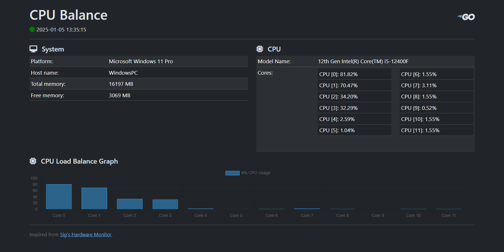

# CPU Balance

Monitors core activity to maximize multiprocessing.

## Purpose

Modern CPUs are usually multi-core processors. However, unless special considerations are made, processes are usually single-threaded. The goal of this app is to allow remote monitoring of CPU activity across multiple cores and see the difference in CPU core activity.

## Technologies Used

1. Programming Language: [Go](https://go.dev/)
2. [HTMX](https://htmx.org/) is used to enable direct access to dynamic behavior using HTML and CSS without additional Javascript
3. [Websocket](http://github.com/coder/websocket) is used as the application is expected to remain alive and update in a periodic pattern. WebSocket reduces the data transmission overhead compared to HTTP-based alternatives.
4. [gopsutil](https://github.com/shirou/gopsutil/) is used to obtaining system information due to the ease of access of system information.
5. [Bootstrap](https://getbootstrap.com/docs/5.3/getting-started/introduction/) for theming and styles as there are predefined templates for grid and content presentation suitable for this project.
6. [Chart.js](https://www.chartjs.org/docs/latest/) is used to display charts as its free and the results are easy to read. 

## Architecture

### Model-View-Controller (MVC) pattern

This application uses the Model-View-Controller pattern, where:

1. Model: System data, accessed via `gopsutil`
2. View: HTMX content displayed when user establishes a WebSocket connection
3. Controller: Go server, which accepts WebSocket connection request and streams data to the client.

This pattern is chosen because of the ease of working on each part separately and makes debugging issues (on presentation vs data) easier.

## Installation

1. Clone the repository
2. Change directory into `cpu-balance` repository folder
3. Run `go mod tidy` to update and cleanup `go.mod` and `go.sum` files
4. Run `go run ./cmd/main.go` to start the program
5. Access the CPU balance dashboard at `[http://localhost:8080/](http://localhost:8080/)`

## Credits

- [sigrdrifa's go-htmx-websockets-example](https://github.com/sigrdrifa/go-htmx-websockets-example) for inspiration